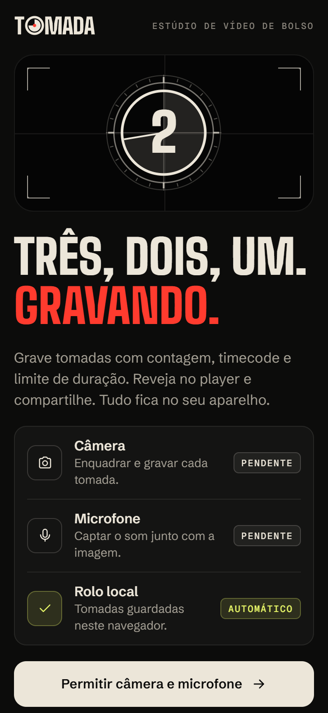

# Tomada

Estúdio de vídeo de bolso: grave tomadas com cronômetro e limite de duração, reveja no player, compartilhe e organize tudo num rolo local.

**[Ver ao vivo](https://leandromlmoreira.github.io/video-capture/)**


<p>
  
  
  
</p>


## Funcionalidades

- **Gravação com estado real**: botão que vira "parar" com animação, luz de REC pulsando, timecode `mm:ss:quadros` e anel de progresso até o limite.
- **Limite de duração**: 15 s, 30 s, 60 s ou livre. No aparelho vira `maxDuration` do `expo-camera`; na web, um timer encerra o `MediaRecorder`.
- **Enquadramento**: cantos de visor e grade dos terços que liga e desliga; câmera frontal ou traseira.
- **Rolo de tomadas**: cada gravação vira uma tomada numerada com pôster próprio em SVG, data, duração e origem. Fica salvo entre sessões.
- **Player**: `expo-video` com controles nativos, ficha da tomada e ações de compartilhar, salvar na galeria e excluir com confirmação.
- **Permissões bem explicadas**: tela dedicada com o status de câmera, microfone e galeria, e atalho para os ajustes quando o sistema bloqueia.
- **Web de verdade**: usa a webcam do navegador via `MediaRecorder` quando existe e é permitida. Sem webcam, o modo demonstração grava uma cena gerada em tempo real num `<canvas>`, com o mesmo fluxo do app.

## Como funciona por plataforma

| | Android / iOS | Web |
| --- | --- | --- |
| Visor | `CameraView` do `expo-camera` | `<video>` com `getUserMedia` ou `<canvas>` animado |
| Gravação | `recordAsync` / `stopRecording` | `MediaRecorder` (MP4 quando o navegador suporta, senão WebM) |
| Rolo | arquivo movido para `Paths.document` + metadados no AsyncStorage | vídeo e metadados no IndexedDB |
| Compartilhar | `expo-sharing` | Web Share API com arquivo, ou download |
| Galeria | `expo-media-library` | não se aplica |

A troca é feita pela resolução de arquivos do Metro (`Viewfinder.web.tsx`, `recordingStore.web.ts`, `useCaptureAccess.web.ts`, `shareRecording.web.ts`, `mediaLibrary.web.ts`), sem `if (Platform.OS === "web")` espalhado pelos componentes.

## Stack

- Expo SDK 57, React Native 0.86, React 19, TypeScript
- `expo-camera`, `expo-video`, `expo-media-library`, `expo-sharing`, `expo-file-system`
- `@react-native-async-storage/async-storage`, `react-native-svg`, `react-native-safe-area-context`
- Tipografia via `@expo-google-fonts`: Bricolage Grotesque, Figtree e DM Mono
- Deploy da versão web no GitHub Pages por GitHub Actions

## Estrutura

```
App.tsx                  # fluxo: permissões, estúdio, rolo e player
src/
├── capture/             # visor nativo e web, gravador web e cena de demonstração
├── components/          # access, brand, player, roll, studio e ui
├── domain/              # tipo Recording e formatação de tempo e datas
├── hooks/               # permissões, rolo, gravação, cronômetro e avisos
├── screens/             # tela de permissões, estúdio, rolo e cabeçalho largo
├── storage/             # persistência nativa e web
└── theme/               # tokens de cor, tipografia, raios e curvas de animação
```

## Como rodar

```bash
npm install
npm run android   # ou npm run ios
npm run web       # webcam do navegador ou modo demonstração
```

A gravação no aparelho precisa de um dispositivo físico ou de um development build. Para gerar a versão web estática:

```bash
npx tsc --noEmit
npx expo export --platform web
```

<sub>Projeto que nasceu no desafio "Captura de Vídeo" da Formação React Native Developer da DIO.</sub>
