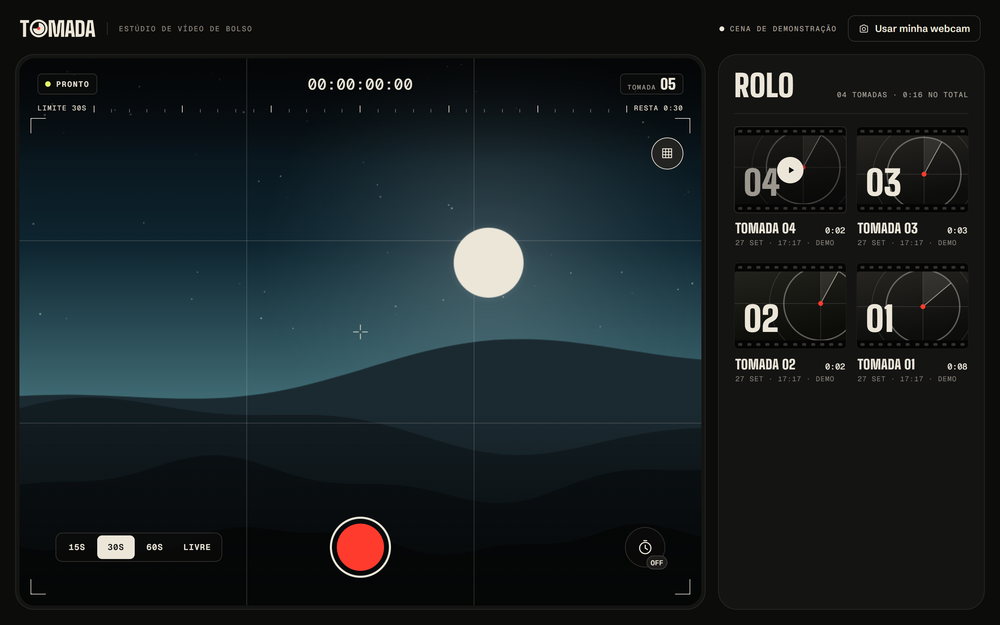
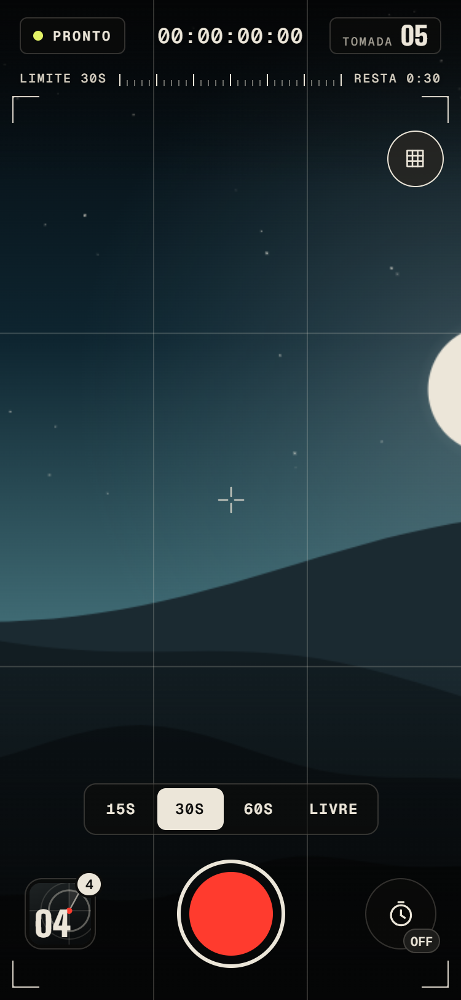
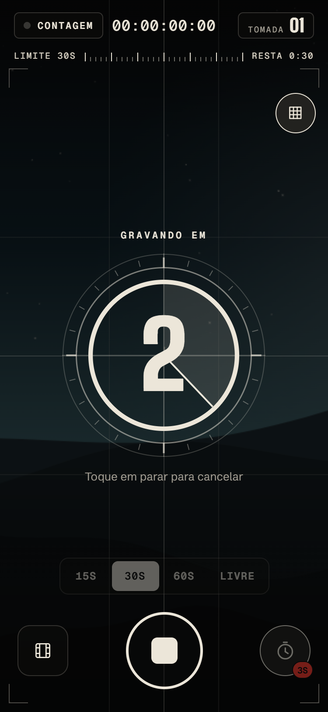
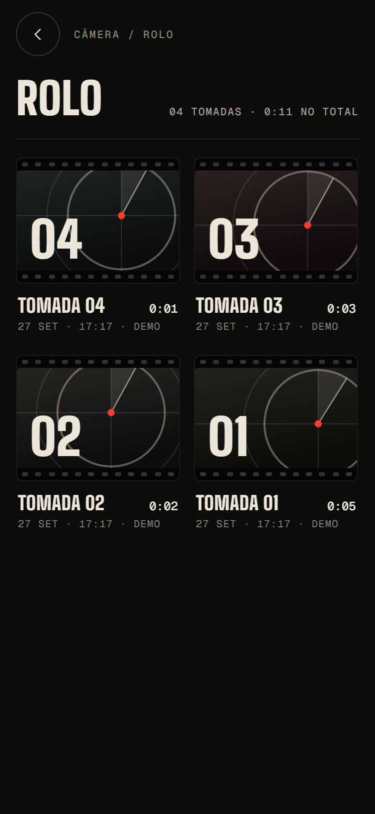
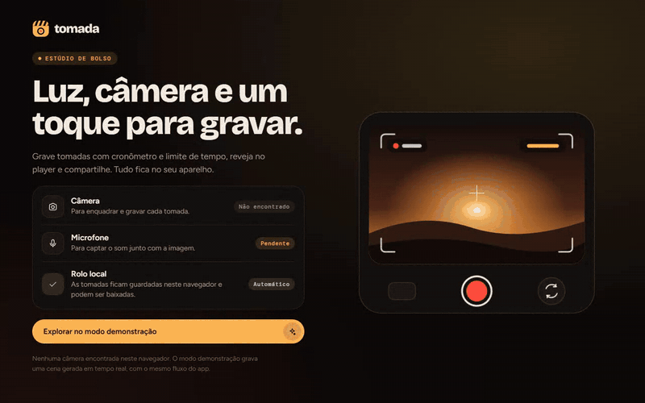

<p align="center">
  <picture>
    <source media="(prefers-color-scheme: dark)" srcset="assets/brand/wordmark.svg" />
    
  </picture>
</p>

<p align="center">Estúdio de vídeo de bolso: conte três, dois, um, grave com timecode e limite de duração, reveja no player e compartilhe.</p>

<p align="center"><strong><a href="https://leandromlmoreira.github.io/video-capture/">Ver ao vivo</a></strong></p>



<p>
  
  
  
</p>



## Identidade visual

**Conceito: o segundo antes da tomada.** O nome vem da tomada de cinema, o take. A marca nasce do *leader*, o contador que roda na ponta do filme (3, 2, 1) até a luz vermelha de gravação acender. O símbolo é esse instante congelado: um anel de visor, a varredura do contador a três quartos da volta e, no centro, o ponto vermelho do tally. No logotipo ele ocupa o lugar do O de TOMADA.

A escolha amarra marca e produto: a mesma varredura aparece na contagem regressiva antes de gravar, na tela de abertura, nos pôsteres de cada tomada e no og-image. O vermelho é reservado: só acende no símbolo e quando a câmera está gravando.

| Papel | Cor | Uso |
| --- | --- | --- |
| Negativo | `#0C0C0B` | fundo, texto sobre botões claros |
| Osso | `#ECE6D9` | texto, traços do leader, botão principal |
| Tally | `#FF3B2E` | REC, moldura de gravação, ponto do símbolo |
| Pico | `#E3F266` | estado pronto e permissões liberadas (cor de focus peaking) |
| Grafite | `#A39E93` / `#8A857C` | texto secundário e rótulos |

**Tipografia (Google Fonts):** Big Shoulders para títulos e números de tomada, condensada como letreiro de claquete; Schibsted Grotesk para interface e texto corrido; Geist Mono para timecode, fita de limite e dados técnicos.

Os tokens ficam em [`src/theme/tokens.ts`](src/theme/tokens.ts). Os arquivos da marca estão em [`assets/brand`](assets/brand) (símbolo, logotipo claro e escuro, ícone em SVG), com ícone do app, ícone adaptativo do Android, splash, favicon e [og-image](public/og-image.png) gerados a partir deles.

## Funcionalidades

- **HUD de câmera**: estado PRONTO / CONTAGEM / REC / SALVANDO, timecode `HH:MM:SS:QQ` a 30 quadros, número da próxima tomada, fita de limite com marcas por segundo e moldura vermelha enquanto grava.
- **Contagem regressiva** de 3 ou 5 segundos antes de gravar, no estilo leader de filme, com bip curto na web e vibração no aparelho. Tocar de novo cancela.
- **Botão de gravar** que vira "parar" com transição, pulso de tally e anel de progresso até o limite.
- **Limite de duração**: 15 s, 30 s, 60 s ou livre. No aparelho vira `maxDuration` do `expo-camera`; na web, um timer encerra o `MediaRecorder`. Nos últimos cinco segundos o restante fica vermelho e cada segundo vibra.
- **Haptics** com `expo-haptics`: seleção de limite, contagem, início e fim da tomada, exclusão.
- **Rolo de tomadas** como folha de contato: cada gravação vira um fotograma perfurado com pôster próprio em SVG (varredura proporcional à duração), data, duração e origem. Fica salvo entre sessões.
- **Player** com `expo-video`, ficha de claquete (data, hora, duração, origem, lente, arquivo) e ações de compartilhar, salvar na galeria e excluir com confirmação.
- **Permissões explicadas**: checklist de câmera, microfone e rolo, painel com passo a passo quando a câmera está bloqueada e atalho para os ajustes no aparelho.
- **Web de verdade**: usa a webcam via `MediaRecorder` quando existe e é permitida. Sem webcam, o modo demonstração grava uma cena noturna gerada em tempo real num `<canvas>`.
- **Acessibilidade**: rótulos em todos os controles, foco visível na web e animações reduzidas quando o sistema pede menos movimento.

## Como funciona por plataforma

| | Android / iOS | Web |
| --- | --- | --- |
| Visor | `CameraView` do `expo-camera` | `<video>` com `getUserMedia` ou `<canvas>` animado |
| Gravação | `recordAsync` / `stopRecording` | `MediaRecorder` (MP4 quando o navegador suporta, senão WebM) |
| Rolo | arquivo movido para `Paths.document` + metadados no AsyncStorage | vídeo e metadados no IndexedDB |
| Compartilhar | `expo-sharing` | Web Share API com arquivo, ou download |
| Galeria | `expo-media-library` | não se aplica |
| Retorno tátil e sonoro | `expo-haptics` | vibração quando existe e bip via Web Audio |

A troca é feita pela resolução de arquivos do Metro (`Viewfinder.web.tsx`, `recordingStore.web.ts`, `useCaptureAccess.web.ts`, `shareRecording.web.ts`, `mediaLibrary.web.ts`, `beep.web.ts`), sem `if (Platform.OS === "web")` espalhado pelos componentes.

## Stack

- Expo SDK 57, React Native 0.86, React 19, TypeScript
- `expo-camera`, `expo-video`, `expo-media-library`, `expo-sharing`, `expo-file-system`, `expo-haptics`, `expo-splash-screen`
- `@react-native-async-storage/async-storage`, `react-native-svg`, `react-native-safe-area-context`
- Tipografia via `@expo-google-fonts`: Big Shoulders, Schibsted Grotesk e Geist Mono
- Testes com `node:test` direto nos arquivos TypeScript
- Deploy da versão web no GitHub Pages por GitHub Actions

## Estrutura

```
App.tsx                  # fluxo: permissões, estúdio, rolo e player
assets/brand/            # símbolo, logotipo e ícone em SVG
src/
├── brand/               # geometria do símbolo e traçado do logotipo
├── capture/             # visor nativo e web, gravador web e cena de demonstração
├── components/          # access, brand, player, roll, studio e ui
├── domain/              # tomada, formatação, contagem e limite
├── feedback/            # haptics e bip da contagem
├── hooks/               # permissões, rolo, gravação, cronômetro e movimento reduzido
├── screens/             # permissões, estúdio, rolo e cabeçalho largo
├── storage/             # persistência nativa e web
└── theme/               # tokens de cor, tipografia, raios e curvas de animação
tests/                   # testes de formatação, contagem, limite e geometria
```

## Como rodar

```bash
npm install
npm run android   # ou npm run ios
npm run web       # webcam do navegador ou modo demonstração
npm test          # testes de domínio
npm run typecheck
```

A gravação no aparelho precisa de um dispositivo físico ou de um development build. Para gerar a versão web estática:

```bash
npx expo export --platform web
```

No GitHub Actions o caminho base vem do nome do repositório (`EXPO_BASE_URL`), então o deploy continua certo mesmo se o repositório for renomeado.

<sub>Projeto que nasceu no desafio "Captura de Vídeo" da Formação React Native Developer da DIO.</sub>
